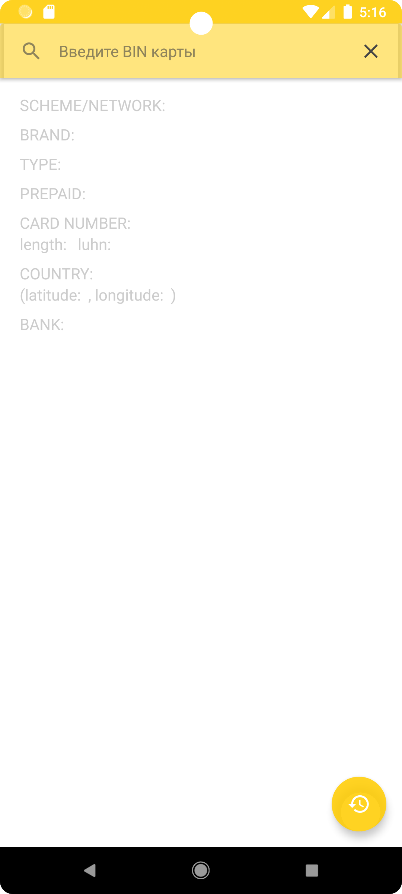
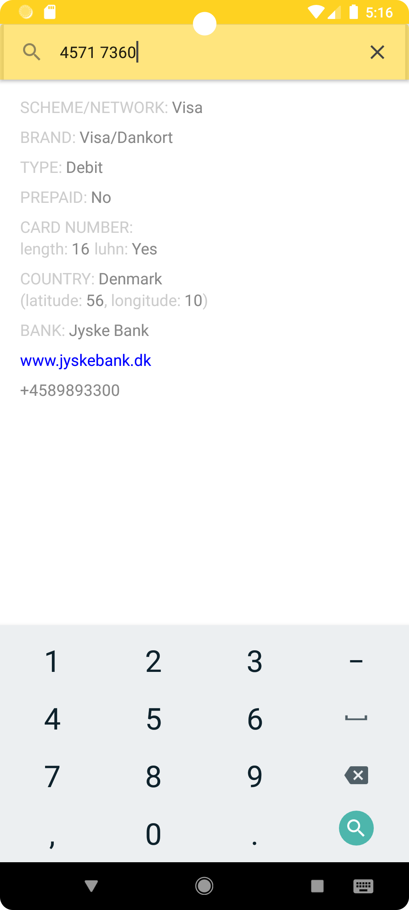
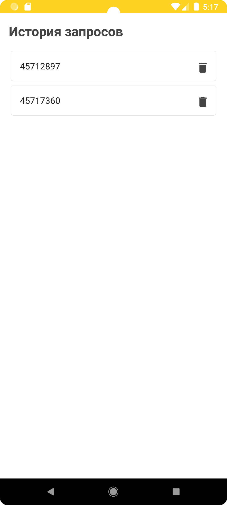

# Binfo

#### Стек:

- Kotlin
- Clean Architecture
- MVVM
- Jetpack Compose
- Coroutine
- Dagger / Hilt
- Room
- Retrofit
- Moshi

#### Приложение для получения информации о банковской карте по её BIN*.

  Приложение позволяет пользователю по BIN карты узнать такие данные, как тип карты, страна/банк выпуска, URL и телефон банка. По клику на страну, URL и телефон открывакарты, браузер и "звонилка" соответственно. 

 \* **BIN** - *первые 6 или 8 цифр номера банковской карты.* 

    
    
    

